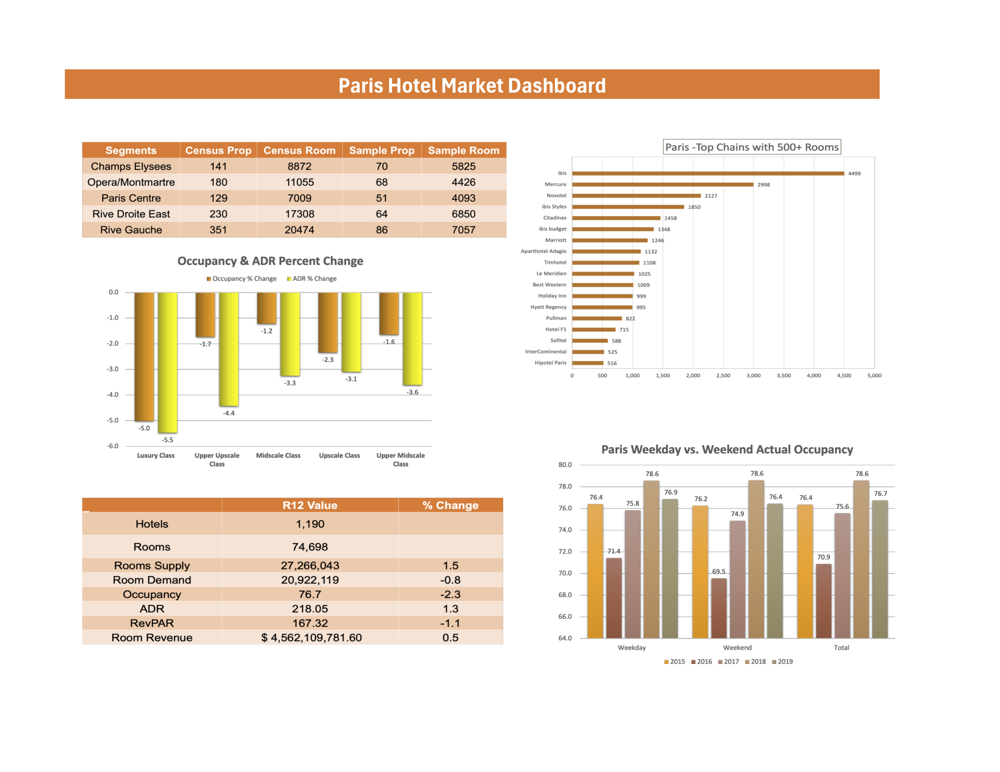

# Corlon Russell Portfolio

## Case Study: Paris Hotel Market Study (2023)
Analyzed the Paris Hotel Market to identify the cause of decreased occupancy with increased room supply. 

 

### North Star Metrics & Dimensions 
- Average daily rate (ADR)
- Revenue per available room (RevPAR)
- Actual Occupancy
- Group & Transient Demand
- Market Breakdown

### Summary of Insights:

- Market Breakdown: There has been significant growth in new independent brands. This has led to the conclusion that these brands are priced within the midscale and upper-midscale class, gravitating hoteliers from luxury brands.
- Average daily rate (ADR): Rive Droite East and Rive Gauche are the two primary submarkets with the highest occupancy and lowest ADR, predicting that hoteliers' demand is transitioning toward more midscale and upper-midscale classes.
- Actual Occupancy: Occupancy tends to be higher through the weekday than the weekend.
- Group & Transient Demand: Transient booking demands generate the most revenue gained versus group segments.

### Recos & Next Steps:

- Due to occupancy performance, there are opportunities to host midweek events or run promotions.
- Fun/leisure activities can occur within submarkets where hoteliers gravitate toward the desired class of brands.
- Hoteliers demand savings in rates when booking within the Paris market. Think about partnering with independent chains to offer deal specials with their stay.

- The Luxury class of brands declined tremendously. Monitor closely how this will impact new hotel openings that would like to be categorized within this segment.
- Upper Upscale & Upscale brands can bypass lower-class segments with new attractions within the area.
- There are incentive opportunities to boost group segment booking during low ADR & occupancy months within the year.

